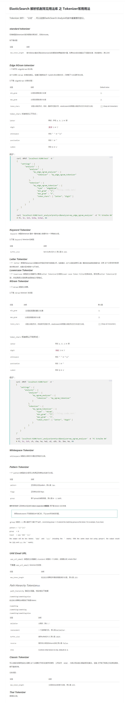
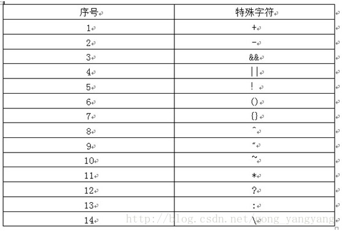

## es 内置分词器介绍

- 1、标准分词器 Standard Tokenizer

一个标准的分词器提供基于语法的分词器，那是一个适合大部分欧洲语言文档的很好的分词器。分词器实现Unicode文本分割算法，该分割算法在Unicode Standard Annex #29中指定。

- 2、连词分词器 NGram Tokenizer
如果词的长度大于最短词长度则分词，则依次分成最小长度递进到最大长度的词。
例如：中华人民共和国 min_gram=2,max_gram=3。结果：中华、中华人、华人、华人民、人民、人民共、民共、民共和、共和、共和国、和国。

- 3、边际连词分词器 Edge NGram Tokenizer
该分词器和nGram分词器很类似，但是分的词仅仅包含该词的开始部分。
分词属性和NGram Tokenizer的一样。
例如：中华人民共和国 全国人大 min_gram=2,max_gram=5,"token_chars":["letter","digit"]
结果：中华、中华人、中华人民、中华人民共、全国、全国人、全国人大
注意：单个词'中华人民共和国'的长度大于5，'和国'不会出现在分词结果中。

- 4、关键字分词器 Keyword Tokenizer
keyword分词器输出和它接收到的相同的字符串。即不分词，可以设置关键字的长度buffer_size默认256。

- 5、字符分词器 Letter Tokenizer
字符(letter)类型分词器将文本按非字符(non-lentter)进行分词。这就是说，它定义临近的最大长度的字符为一个词。注意，这个适合大部分欧洲的语言，但是对一些亚洲的语言来说就很糟糕了，它们的词不是以空格来分割的。

- 6、小写分词器 Lowercase Tokenizer
lowercase将词全部转换成小写，其他的同letter Tokenizer

- 7、空格分词器Whitespace Tokenizer
以空格来分词

- 8、模式分词器/正则分词器 Pattern Tokenizer
根据正则表达式的匹配规则来分词。
group set to -1 (the default) is equivalent to "split". Using group >= 0 selects the matching group as the token. For example, if you have:
pattern = '([^']+)' group   = 0 input   = aaa 'bbb' 'ccc'
the output will be two tokens: 'bbb' and 'ccc' (including the ' marks). With the same input but using group=1, the output would be: bbb and ccc (no ' marks).

- 9、标准Email URL分词器 UAX Email URL Tokenizer
和标准分词器一样，但是把email和url当作一个词。
UAX Email URL Tokenizer有人翻译为'不拆分email、url的分词器'，觉得不太恰当，UAX个人认为是Unicode Standard Annex，见标准分词器中。

- 10、路径层次分词器 Path Hierarchy Tokenizer
例如：/something/something/else
结果：/something、/something/something、/something/something/else
默认定界符： /

- 11、典型的编译器 Classic Tokenizer
classic分词器提供基于语法的分词器，这对英语文档是一个很好的分词器。


## 查看分词器效果

head插件

- es  1.7.2 版本：

  ```
  http://10.37.253.31:9200/qdp-oasis-person-test/

  _analyze?pretty=true&analyzer=ngram_analyzer&text=zh-hao-1-2-2302

  get

  {}

  ```


执行看结果

- 新版本

```
GET analyze_sample/_analyze
{
  "analyzer" : "whitespace",
  "text" : "this is a test"
}
```


## 分词介绍

ES中，可以实现一字一词的的分词器是NGram。

### 1、什么是ngram

例如英语单词 quick，5种长度下的ngram

```
ngram length=1，q u i c k
ngram length=2，qu ui ic ck
ngram length=3，qui uic ick
ngram length=4，quic uick
ngram length=5，quick

```

### 2、什么是edge ngram

quick这个词，抛锚首字母后进行ngram

```
q
qu
qui
quic
quick

```

使用edge ngram将每个单词都进行进一步的分词和切分，用切分后的ngram来实现前缀搜索推荐功能


**4、试验一下ngram**

```
PUT /my_index
{
  "settings": {
    "analysis": {
      "filter": {
        "autocomplete_filter" : {
          "type" : "edge_ngram",
          "min_gram" : 1,
          "max_gram" : 20
        }
      },
      "analyzer": {
        "autocomplete" : {
          "type" : "custom",
          "tokenizer" : "standard",
          "filter" : [
            "lowercase",
            "autocomplete_filter"
          ]
        }
      }
    }
  }
}

```

```
PUT /my_index/_mapping/my_type
{
  "properties": {
      "title": {
          "type":     "string",
          "analyzer": "autocomplete",
          "search_analyzer": "standard"
      }
  }
}

```

注意这里search_analyzer为什么是standard而不是autocomplete？

因为搜索的时候没必要在进行每个字母都拆分，比如搜索hello w。直接拆分成hello和w去搜索就好了，没必要弄成如下这样：

```
h
he
hel
hell
hello   

w

```

弄成这样的话效率反而更低了。


---


{  
  "settings": {  
    "analysis": {  
      "analyzer": {   
        "charSplit": {  
          "type": "custom",  
              "tokenizer": "ngram_tokenizer"  
        }  
      },  
     "tokenizer": {  
           "ngram_tokenizer": {  
             "type": "nGram",  
             "min_gram": "1",  
             "max_gram": "1",  
             "token_chars": [  
               "letter",  
               "digit",  
               "punctuation"  
             ]  
           }  
        }  
      }  
   }  
}  


示例代码：

```
/** * 创建一个索引 * @param indexName 索引名 */  
public static void createIndex2(TransportClient client, String indexName) {  
    try {  
        /*
            OpenIndexResponse indexOpen = client.admin().indices().prepareOpen(indexName).get();
            if (indexOpen.isAcknowledged())
            {
                System.out.println("open " + indexOpen.isAcknowledged()); // true表示创建成功
                client.admin().indices().prepareClose(indexName);
            }
            */  
            {  
                try {  
                    XContentBuilder settingsBuilder = XContentFactory.jsonBuilder()  
                            .startObject()  
                            .startObject("analysis")  
                            .startObject("analyzer")  
                            .startObject("DoubleAnalyzer")  
                            .field("tokenizer", "my_ngram_tokenizer")  
                            .endObject()  
                            .endObject()  

                            .startObject("tokenizer")  
                            .startObject("my_ngram_tokenizer")  
                            .field("type", "ngram")  
                            .field("min_gram", 2)  
                            .field("max_gram", 2)  
                            .field("token_chars", "letter, digit")  
                            .endObject()  
                            .endObject()  
                            .endObject()  
                            .endObject();  

                    CreateIndexResponse indexResponse = client  
                            .admin()  
                            .indices()  
                            .prepareCreate(indexName)  
                            .setSettings(settingsBuilder)  
                            .get();  

                    System.out.println(indexResponse.isAcknowledged()); // true表示创建成功  
                }  
                catch (Exception e) {  
                    e.printStackTrace();  
                }  
            }  
    } catch (ElasticsearchException e) {  
        e.printStackTrace();  
    }  
}  
```


# ElasticSearch 解析机制常见用法库 之 Tokenizer常用用法

Tokenizer 译作：“分词”，可以说是ElasticSearch Analysis机制中最重要的部分。





# ElasticSearch检索时特殊字符处理

ElasticSearch检索时，出现特殊字符而没有做正确的处理，那么ElasticSearch将无法识别这条检索语句，则会抛出异常，此时就的对检索语句进行转义；

例如：

```
String title = "title+-&&||!(){}[]^\"~*?:\\";
title = QueryParser.escape(title);  // 主要就是这一句把特殊字符都转义,那么lucene就可以识别
searchRequestBuilder.setQuery(QueryBuilders.fieldQuery("title", title));

```

特殊字符如下



特殊符号

注：如果所查询的词中本身包含关键字，则需要用\进行转义。


---
