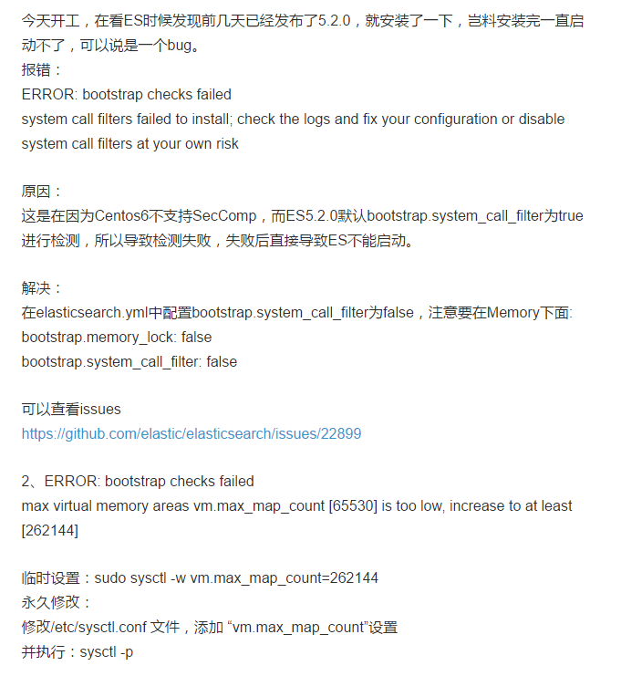

### 报错

system call filters failed to install; check the logs and fix your configuration or disable system call filters at your own risk

- 解决方法：

---

如果想插入和修改后立即可以查到数据，
更新的时候设置 refresh_policy 为 immediately 即可，
如果不设置默认是不会立刻刷新的，需要等待索引 index.refresh_interval 设置的时间到了才会自动刷新

---

